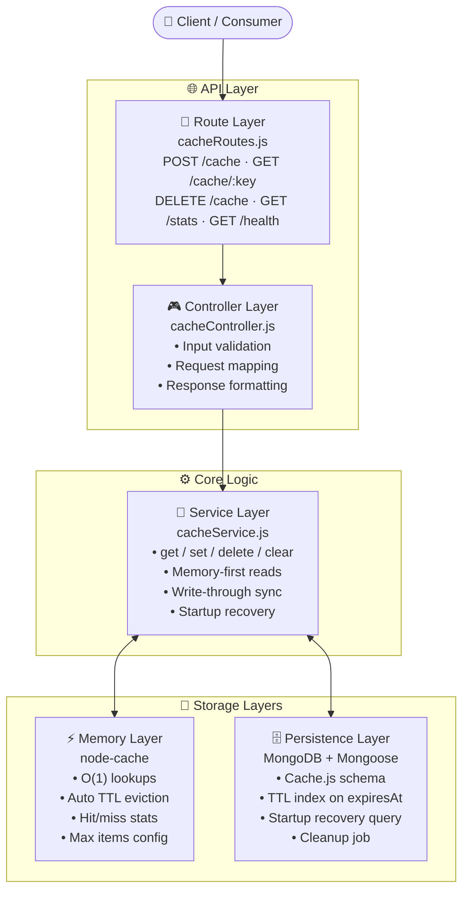
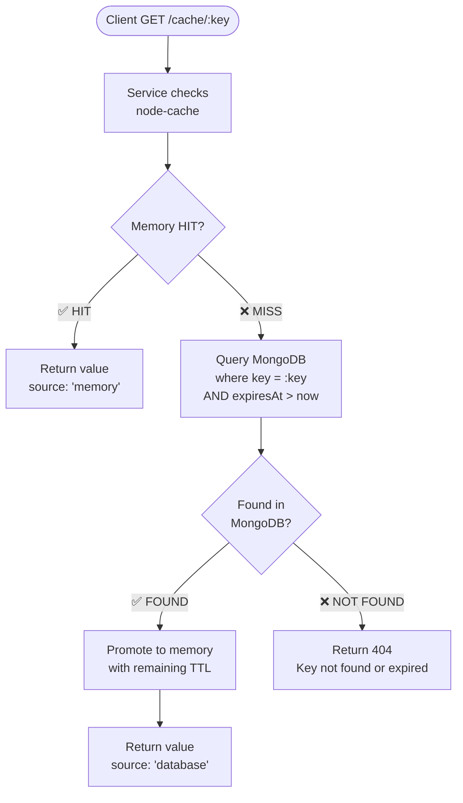
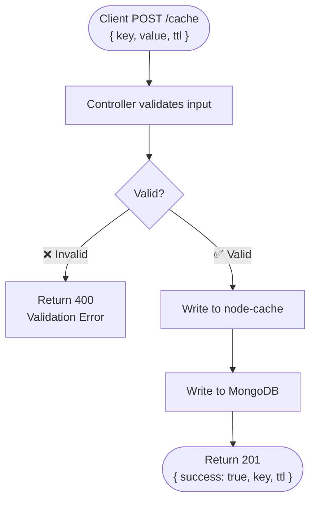
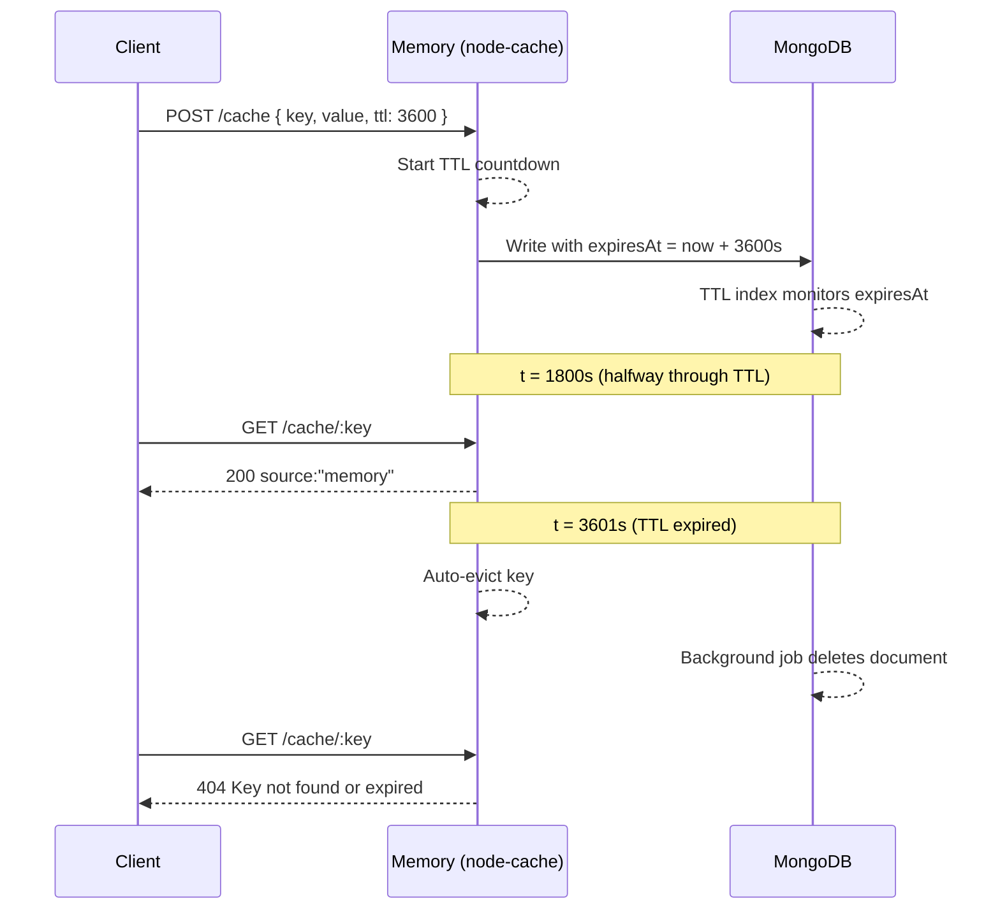

<div align="center">


<br/>

[](https://nodejs.org/)
[](https://expressjs.com/)
[](https://www.mongodb.com/)
[](https://mongoosejs.com/)
[](https://www.npmjs.com/package/dotenv)

<br/>

[](./LICENSE)
[](https://github.com/pratham18sri/hybrid-cache/pulls)
[](https://github.com/pratham18sri)
[]()

<br/>

> **A production-ready Node.js + Express backend implementing a hybrid cache architecture.**
> Combining microsecond in-memory reads with MongoDB-backed durability — so your cache survives server restarts.

<br/>
<br/>

[📖 Documentation](#-api-reference) · [🚀 Quick Start](#-local-setup) · [🏗️ Architecture](#-architecture-overview) · [🐛 Report Bug](https://github.com/pratham18sri/hybrid-cache/issues)

</div>

---

## 📖 Table of Contents

- [What is This?](#-what-is-this)
- [Why This Project?](#-why-this-project)
- [Architecture Overview](#-architecture-overview)
- [Core Features](#-core-features)
- [Tech Stack](#-tech-stack)
- [Project Structure](#-project-structure)
- [How It Works](#-how-it-works)
- [Local Setup](#-local-setup)
- [Environment Variables](#-environment-variables)
- [API Reference](#-api-reference)
- [Error Handling](#-error-handling)
- [Reliability & Production Notes](#-reliability--production-notes)
- [Future Enhancements](#-future-enhancements)
- [Documentation](#-documentation)
- [Author](#-author)

---

## 🤔 What is This?

A **Node.js + Express** REST API that solves the most common cache problem — **data loss on server restart** — by combining two storage layers into one unified system.

```
Client Request
      │
      ▼
 ┌──────────┐    HIT   ┌─────────────────────┐
 │ Express  │─────────►│  In-Memory Cache     │  ← μs reads
 │ REST API │          │  (node-cache)        │
 └──────────┘          └─────────────────────┘
      │                          │ MISS
      │ Write-Through            ▼
      │                ┌─────────────────────┐
      └───────────────►│  MongoDB            │  ← Persistent fallback
                       │  (TTL Persistence)  │
                       └─────────────────────┘
```

> **The rule:** Read memory first → fall back to DB → promote DB result back to memory. Write to both layers simultaneously, always.

---

## 💡 Why This Project?

Most cache implementations have **one fatal flaw**: restart the server and everything is gone. This project solves that with a write-through hybrid architecture.

| Problem | This System's Solution |
|---|---|
| Data lost on restart | Write-through persistence to MongoDB on every write |
| Slow DB reads for hot keys | In-memory layer handles repeated reads in microseconds |
| Stale data accumulating | Independent TTL expiration enforced in both layers |
| Unbounded memory growth | Configurable `CACHE_MAX_ITEMS` cap in node-cache |
| Invisible cache misses | `source` field in every response (`"memory"` or `"database"`) |

---

## 🏗️ Architecture Overview

### System Architecture



---

### Read Flow — `GET /cache/:key`



---

### Write Flow — `POST /cache`



---

### Startup Recovery Flow


---

### TTL Expiration — Sequence



---

## ✨ Core Features

| Feature | Description |
|---|---|
| **🔀 Hybrid Cache** | Memory-first reads with MongoDB as durable fallback |
| **✍️ Write-Through** | Every write persists to both memory and MongoDB simultaneously |
| **🔄 Startup Recovery** | On boot, valid DB entries are restored into memory (pre-warmed) |
| **⏱️ TTL Expiration** | Independent TTL: node-cache eviction + MongoDB TTL index |
| **🏷️ Source Tagging** | Every GET includes `source: "memory"` or `source: "database"` |
| **📊 Cache Stats** | `/cache/stats` — hits, misses, key count, DB docs, heap usage |
| **❤️ Health Check** | `/health` — uptime and live MongoDB connectivity status |
| **🛑 Graceful Shutdown** | Clean HTTP + Mongoose closure on `SIGTERM` / `SIGINT` |
| **🛡️ Input Validation** | Key (non-empty, max 128 chars), TTL (1–2,592,000 sec) |
| **🧹 Cleanup Job** | Background job purges expired MongoDB documents periodically |

---

## 🛠️ Tech Stack

| Layer | Technology | Version | Purpose |
|---|---|---|---|
| Runtime | **Node.js** | v18+ | JavaScript server runtime |
| Framework | **Express.js** | 4.x | HTTP routing + middleware pipeline |
| Memory Cache | **node-cache** | latest | Fast in-process key-value store |
| Database | **MongoDB** | 6.x | Persistent document storage |
| ODM | **Mongoose** | 7.x | Schema modeling + TTL index management |
| Config | **dotenv** | latest | Environment variable loader |

---

## 📁 Project Structure

```
hybrid-cache/
│
├── 📁 config/
│   └── db.js                  # MongoDB connection + retry/error handling
│
├── 📁 controllers/
│   └── cacheController.js     # HTTP handlers: validates input, calls service
│
├── 📁 middleware/
│   └── errorMiddleware.js     # 404 catch-all + global error handler
│
├── 📁 models/
│   └── Cache.js               # Mongoose schema: key, value, expiresAt + TTL index
│
├── 📁 routes/
│   └── cacheRoutes.js         # Express router: maps endpoints to controllers
│
├── 📁 services/
│   └── cacheService.js        # Core logic: get/set/delete/clear/stats/recovery
│
├── 📄 .env.example            # Template: copy to .env and fill values
├── 📄 demonstration_guide.md  # Step-by-step live demo walkthrough
├── 📄 MENTOR_GUIDE.md         # Reviewer / mentor presentation notes
├── 📄 server.js               # Entry point: startup, shutdown, middleware setup
└── 📄 README.md               # You are here
```

### Dependency Map

```
server.js
    ├── config/db.js              → Connects MongoDB on startup
    ├── routes/cacheRoutes.js     → Registers all HTTP endpoints
    ├── services/cacheService     → Calls recoverFromDB() on boot
    └── Graceful shutdown         → Closes HTTP server then Mongoose

routes/cacheRoutes.js
    └── controllers/cacheController.js

controllers/cacheController.js
    ├── Validates: key (string, max 128), ttl (int, 1–2592000)
    └── services/cacheService.js

services/cacheService.js
    ├── node-cache (memory reads/writes)
    └── models/Cache.js (MongoDB reads/writes)
```

---

## 🔄 How It Works

<details>
<summary><b>Write Flow — POST /cache</b></summary>

```
Client POST { key, value, ttl }
        │
        ▼
Controller validates input
        │
        ▼
Service writes to node-cache  ──────────────► Memory updated ✓
        │
        ▼
Service writes to MongoDB     ──────────────► DB updated ✓
        │
        ▼
Response: { success: true, source: "write-through" }
```

</details>

<details>
<summary><b>Read Flow — GET /cache/:key</b></summary>

```
Client GET /cache/:key
        │
        ▼
Service checks node-cache
        │
   HIT ─┤─ MISS
        │       │
        ▼       ▼
   Return    Query MongoDB
   memory      │
   value    FOUND ─┤─ NOT FOUND
               │           │
               ▼           ▼
          Promote to    Return 404
          memory
               │
               ▼
          Return value
          { source: "database" }
```

</details>

<details>
<summary><b>Startup Recovery</b></summary>

```
Server boots
     │
     ▼
MongoDB connects
     │
     ▼
Query: find all where expiresAt > now()
     │
     ▼
For each valid document → write to node-cache with remaining TTL
     │
     ▼
Server ready — memory pre-warmed from DB
```

</details>

<details>
<summary><b>TTL Expiration</b></summary>

```
Memory layer:   node-cache auto-evicts keys when TTL expires
                (no manual intervention needed)

Database layer: MongoDB TTL index on `expiresAt` field
                Background thread deletes expired docs
                (typically within 60 seconds of expiry)
```

</details>

---

## 🚀 Local Setup

### Prerequisites

- [Node.js v18+](https://nodejs.org/en/download)
- [MongoDB](https://www.mongodb.com/try/download/community) locally, or a [MongoDB Atlas](https://www.mongodb.com/cloud/atlas) URI

### Step 1 — Clone and install

```bash
git clone https://github.com/pratham18sri/hybrid-cache.git
cd hybrid-cache
npm install
```

### Step 2 — Set up environment

```bash
# Windows
copy .env.example .env

# macOS / Linux
cp .env.example .env
```

### Step 3 — Configure `.env`

```env
PORT=5000
MONGO_URI=mongodb://127.0.0.1:27017/hybrid_cache
CACHE_TTL=300
CACHE_MAX_ITEMS=10000
```

### Step 4 — Start the server

```bash
# Development (auto-restart)
npm run dev

# Production
npm start
```

### Step 5 — Verify

```bash
curl http://localhost:5000/health
```

**Expected:**
```json
{
  "status": "ok",
  "uptime": 3.24,
  "database": "connected"
}
```

---

## 🔐 Environment Variables

| Variable | Required | Default | Description |
|---|---|---|---|
| `PORT` | No | `5000` | Port Express listens on |
| `MONGO_URI` | **Yes** | — | MongoDB connection string |
| `CACHE_TTL` | No | `300` | Default TTL in seconds (5 min) |
| `CACHE_MAX_ITEMS` | No | `10000` | Max keys in memory cache |

> ⚠️ **Never commit `.env`** — it is already in `.gitignore`.

---

## 📡 API Reference

**Base URL:** `http://localhost:5000`

---

### `GET /health` — Health Check

```bash
curl http://localhost:5000/health
```

**Response `200`:**
```json
{
  "status": "ok",
  "uptime": 42.5,
  "database": "connected"
}
```

---

### `POST /cache` — Create or Update Entry

```bash
curl -X POST http://localhost:5000/cache \
  -H "Content-Type: application/json" \
  -d '{"key":"user:123","value":{"name":"Pratham","role":"admin"},"ttl":3600}'
```

**Request Body:**
```json
{
  "key": "user:123",
  "value": { "name": "Pratham", "role": "admin" },
  "ttl": 3600
}
```

| Field | Type | Required | Constraints |
|---|---|---|---|
| `key` | `string` | ✅ Yes | Non-empty, max 128 characters |
| `value` | `any` | ✅ Yes | Any valid JSON |
| `ttl` | `integer` | ❌ No | 1 – 2,592,000 seconds (30 days max) |

**Response `201`:**
```json
{
  "success": true,
  "key": "user:123",
  "ttl": 3600
}
```

---

### `GET /cache/:key` — Read Entry

```bash
curl http://localhost:5000/cache/user:123
```

**Response `200` — memory hit:**
```json
{
  "key": "user:123",
  "value": { "name": "Pratham", "role": "admin" },
  "source": "memory"
}
```

**Response `200` — database fallback:**
```json
{
  "key": "user:123",
  "value": { "name": "Pratham", "role": "admin" },
  "source": "database"
}
```

**Response `404`:**
```json
{
  "error": "Key not found or expired"
}
```

---

### `DELETE /cache/:key` — Delete One Entry

```bash
curl -X DELETE http://localhost:5000/cache/user:123
```

**Response `200`:**
```json
{
  "success": true,
  "key": "user:123",
  "deleted": true
}
```

---

### `DELETE /cache` — Clear All Entries

```bash
curl -X DELETE http://localhost:5000/cache
```

**Response `200`:**
```json
{
  "success": true,
  "message": "All cache entries cleared"
}
```

---

### `GET /cache/stats` — Cache Statistics

```bash
curl http://localhost:5000/cache/stats
```

**Response `200`:**
```json
{
  "memory": {
    "keys": 142,
    "hits": 5823,
    "misses": 47
  },
  "database": {
    "documents": 156
  },
  "process": {
    "heapUsedMB": 38.4,
    "heapTotalMB": 67.2
  }
}
```

---

### HTTP Status Codes

| Code | Meaning |
|---|---|
| `200` | Success |
| `201` | Entry created |
| `400` | Validation error (invalid key or ttl) |
| `404` | Key not found or expired |
| `500` | Internal server error |

---

## 🛡️ Error Handling

`errorMiddleware.js` provides two global handlers:

**404 — Unknown route:**
```json
{
  "error": "Route not found",
  "path": "/cache/unknown/route"
}
```

**500 — Unhandled error:**
```json
{
  "error": "Internal server error",
  "message": "Connection timeout"
}
```

> All errors include full stack traces in `NODE_ENV=development`.

---

## 🔒 Reliability & Production Notes

| Concern | How It's Handled |
|---|---|
| **Server restart** | MongoDB persistence + startup recovery pre-warms memory on boot |
| **Input abuse** | Key max 128 chars, TTL max 30 days — validated before any write |
| **Memory bloat** | `CACHE_MAX_ITEMS` cap prevents unbounded node-cache growth |
| **Stale DB entries** | MongoDB TTL index + cleanup job auto-removes expired documents |
| **Graceful shutdown** | `SIGTERM`/`SIGINT` drains HTTP, then closes Mongoose cleanly |
| **Startup failure** | DB connect and recovery errors crash loudly with exit code 1 |
| **Response transparency** | `source` on every GET — consumers know exactly where data came from |

---

## 🔮 Future Enhancements

- [ ] **Auth & Authorization** — API key middleware or JWT-based access control
- [ ] **Rate Limiting** — `express-rate-limit` to prevent abuse per IP/key
- [ ] **Test Suite** — Jest + Supertest unit and integration tests across all layers
- [ ] **Structured Logging** — Replace `console.log` with `winston` or `pino`
- [ ] **Docker Support** — `Dockerfile` + `docker-compose.yml` for one-command startup
- [ ] **Redis Adapter** — Swap node-cache for Redis for distributed deployments
- [ ] **Cache Namespacing** — Prefix-based key grouping for bulk operations
- [ ] **Metrics Endpoint** — Prometheus-compatible `/metrics` for Grafana dashboards
- [ ] **Swagger Docs** — Auto-generated OpenAPI spec via `swagger-jsdoc`
- [ ] **Cache Warming** — Pre-seed known keys at startup from a config file

---

## 📚 Documentation

| File | Purpose |
|---|---|
| `README.md` | Project overview, setup guide, API reference *(this file)* |
| `demonstration_guide.md` | Step-by-step walkthrough for running a live demo |
| `MENTOR_GUIDE.md` | Reviewer / mentor guide explaining design decisions |
| `.env.example` | Template with all supported environment variables |

---
---

## 🚀 Recent Improvements (Community Contribution)

- ✨ Added detailed API usage examples using `curl` for better developer clarity  
- 📊 Improved `/cache/stats` documentation with structured breakdown explanation  
- 🛠️ Enhanced error handling section with clear JSON response samples  
- 🔍 Added production reliability notes for better system understanding  
- 📘 Refactored README formatting for improved readability and navigation  

---

## 💡 Usage Tips

- Always validate `TTL` values before sending requests to avoid `400` errors  
- Use `/cache/stats` endpoint to monitor memory usage in real-time  
- Prefer shorter keys for better performance in high-load scenarios  
- Monitor `hits` and `misses` ratio to optimize caching strategy  

---

## ⚡ Performance Insight

A higher cache hit ratio significantly reduces database load and improves response time.  

Aim for:
- 📈 High `hits`
- 📉 Low `misses`

This indicates an efficient caching strategy.

---


